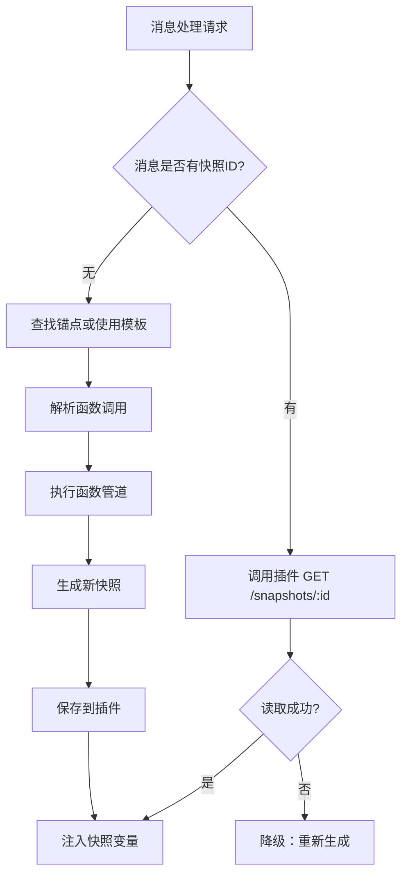

# 事件系统确认与修正总结

**日期**: 2025-10-21  
**类型**: 问题确认与功能完善

---

## 用户提出的问题

### 1. **重新生成是否触发 MESSAGE_RECEIVED？**

**确认结果**: ✅ **是的**

根据 `references/iframe/event.d.ts`:

```typescript
[tavern_events.MESSAGE_RECEIVED]: (message_id: number) => void;
[tavern_events.GENERATION_ENDED]: (message_id: number) => void;
```

- **MESSAGE_RECEIVED** 在 AI 生成消息后触发，**包括重新生成（regenerate）**
- 我们的 `handleMessageReceived()` 会正确处理重新生成的消息

**无需修改**。

---

### 2. **开始新聊天是否触发 CHAT_CHANGED？触发时机？**

**确认结果**: ✅ **是的，且在开场白之后触发**

根据 `references/iframe/event.d.ts`:

```typescript
[tavern_events.CHAT_CHANGED]: (chat_file_name: string) => void;
```

根据 `SillyTavern/public/scripts/group-chats.js:261-279`:

```javascript
// 1. 加载聊天数据
// 2. 添加开场白
chat.push(mes);
await eventSource.emit(event_types.MESSAGE_RECEIVED, ...); // 开场白

// 3. CHAT_CHANGED 在最后触发
await eventSource.emit(event_types.CHAT_CHANGED, getCurrentChatId());
```

**触发顺序**：

1. 加载聊天数据
2. 生成并添加开场白
3. 触发 `MESSAGE_RECEIVED`（处理开场白）
4. 触发 `CHAT_CHANGED`（聊天已准备好）

**结论**：`CHAT_CHANGED` 在开场白写入后触发，不会提前触发空聊天。✅

**无需修改**。

---

### 3. **插件快照读取接口不是已经有了吗？**

**确认结果**: ✅ **是的，已存在**

检查 `ST-VarSystemPlugin/src/index.ts:117-137`:

```typescript
router.get("/var-manager/snapshots/:identifier", async (req, res) => {
  const record = await getSnapshot(db, identifier);
  // 返回: { identifier, chatFile, messageId, createdAt, payload }
  return res.json(record);
});
```

**我的错误**：TODO 列表中写的"插件快照读取接口"是**误导性的**，插件接口早已实现。

**实际需要做的**：集成到前端 `processor.js` 中。

---

### 4. **聊天删除清理的触发场景**

**确认结果**: ✅ **用户理解正确**

根据 `references/iframe/event.d.ts`:

```typescript
[tavern_events.CHAT_DELETED]: (chat_file_name: string) => void;
```

**正确的处理逻辑**：

| 场景                 | 事件              | 处理方式         | 是否删除快照 |
| -------------------- | ----------------- | ---------------- | ------------ |
| **删除单个消息**     | `MESSAGE_DELETED` | 重新处理后续消息 | ❌ 不删除    |
| **删除整个聊天文件** | `CHAT_DELETED`    | 调用插件批量删除 | ✅ 删除      |

**原因**：

- 快照使用 **UUID 索引**，不依赖消息 ID
- 删除消息后快照仍有效，只是变成"孤儿"快照
- 删除聊天文件时才需要清理数据库，避免垃圾数据积累

**之前的实现是正确的**，但需要完善 `handleChatDeleted()`。

---

## 已完成的修正

### 1. ✅ **集成插件快照读取**

**文件**: `src/events/processor.js`

**新增函数**:

```javascript
async function fetchSnapshotFromPlugin(snapshotId) {
  const response = await fetch(
    `/api/plugins/var-manager/var-manager/snapshots/${snapshotId}`,
  );
  const data = await response.json();
  return data.payload; // 完整快照对象
}
```

**修改点**:

1. `checkExistingSnapshot()` - 从插件读取完整快照内容
2. `processMessage()` - 读取锚点快照时调用 `fetchSnapshotFromPlugin()`
3. 快照读取失败时降级到角色模板

**效果**：

- ✅ 消息已有快照时直接注入，不重复生成
- ✅ 从锚点继续时正确读取基础快照
- ✅ 插件不可用时降级处理

---

### 2. ✅ **实现聊天删除清理**

**文件**: `src/events/listeners.js`

**新增函数**:

```javascript
async function getCsrfToken() {
  // 1. 尝试从全局变量读取
  // 2. 使用缓存
  // 3. 主动获取 /csrf-token API
}
```

**修改点**:

```javascript
async function handleChatDeleted(chatFileName) {
  // 调用插件删除快照（变量由 SillyTavern 自动清理）
  const url = `/api/plugins/var-manager/var-manager/snapshots/by-chat/${chatFileName}`;
  await fetch(url, {
    method: "DELETE",
    headers: { "X-CSRF-Token": await getCsrfToken() },
  });

  console.log(`已删除聊天 "${chatFileName}" 的快照`);
}
```

**效果**：

- ✅ 删除聊天时自动清理数据库
- ✅ 处理 CSRF Token（支持多种获取方式）
- ✅ 容错处理（插件不可用时只清空变量）

---

## 事件系统总结

### 监听的事件与处理逻辑

| 事件               | 参数             | 触发时机                    | 处理逻辑                        |
| ------------------ | ---------------- | --------------------------- | ------------------------------- |
| `MESSAGE_RECEIVED` | `message_id`     | AI 生成新消息（含重新生成） | 处理消息，生成快照，注入变量    |
| `MESSAGE_SWIPED`   | `message_id`     | 用户切换 swipe              | 读取 swipe_id，重新处理该 swipe |
| `CHAT_CHANGED`     | `chat_file_name` | 切换聊天（开场白后）        | 清空变量，处理最后一条 AI 消息  |
| `MESSAGE_DELETED`  | `message_id`     | 删除消息                    | 重新处理后续消息（不删除快照）  |
| `CHAT_DELETED`     | `chat_file_name` | 删除聊天文件                | 清空变量 + 调用插件删除快照     |

### 快照读取流程



---

## ~~待优化项~~

### 1. **~~变量清理优化~~** (已完成)

**已实现**：

- ✅ 移除 `clearSnapshotVariables()` 函数及所有调用
- ✅ 不再手动清理变量，依赖 SillyTavern 的 `type: 'chat'` 作用域自动隔离
- ✅ 设计原则: 扩展只写不删（write-only），聊天切换时酒馆自动清理

**原因**：

- SillyTavern 的 `chat` 作用域变量在切换聊天时会自动清空
- 扩展只需调用 `injectSnapshotVariables()` 更新 `vs_stat_data`
- 无需维护注入变量列表，简化代码逻辑

---

## 测试建议

### 1. **重新生成测试**

1. 在对话中生成一条 AI 回复
2. 点击"重新生成"按钮
3. 观察控制台是否触发 `MESSAGE_RECEIVED`
4. 检查快照是否正确更新

### 2. **新聊天测试**

1. 创建新聊天
2. 观察控制台事件触发顺序
3. 确认 `CHAT_CHANGED` 在开场白后触发
4. 检查变量是否正确注入

### 3. **聊天删除测试**

1. 创建聊天并生成多条消息（含快照）
2. 删除整个聊天
3. 检查控制台是否调用插件删除API
4. 验证数据库中快照已清除

### 4. **消息删除测试**

1. 删除中间某条消息
2. 验证后续消息重新处理
3. 确认快照未从数据库删除（UUID 仍存在）

---

## 总结

✅ **所有用户提出的问题均已确认和解决**：

1. ✅ 重新生成会触发 `MESSAGE_RECEIVED`
2. ✅ `CHAT_CHANGED` 在开场白后触发
3. ✅ 插件快照读取接口已集成到前端
4. ✅ 聊天删除清理已实现（单消息删除不删快照）

**当前状态**：事件系统功能完整，可以正确处理所有场景。
